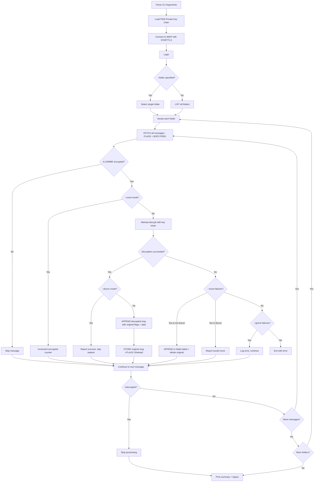

# Decrypt S/MIME Messages — Implementation Plan

## Overview

Create a Python CLI tool (`decrypt-smime.py`) that connects to a Dovecot IMAP server, identifies S/MIME encrypted messages across all folders, decrypts them using one or more PEM private keys via `openssl cms`, and replaces the encrypted originals with decrypted versions while preserving all flags and headers.

## Background

- Emails were synced from Stalwart to local Maildir via offlineimap
- Dovecot 2.4.2 serves the Maildir over IMAP in a Docker container
- S/MIME encryption was applied transparently by Stalwart, causing client compatibility issues
- The existing [`list-all-flags.py`](list-all-flags.py) script provides a reference pattern for IMAP connection, folder enumeration, and flag handling

## Architecture

## CLI Arguments

| Argument | Default | Description |
|---|---|---|
| `--host` | `localhost` | IMAP server hostname |
| `--port` | `8143` | IMAP server port |
| `--user` | `dc` | Username for authentication |
| `--password` | `password` | Password - prompted if empty |
| `--privatekey` | required | Path to PEM private key file |
| `--passphrase` | — | Passphrase for private key (prompted if empty; ignored for unencrypted keys) |
| `--additional-privatekey` | — | Additional PEM private key file (repeatable) |
| `--additional-passphrase` | — | Passphrase for corresponding additional key (repeatable) |
| `--folder` | all folders | Limit to a single folder by name |
| `--count` | false | Show message counts and encrypted counts per folder |
| `--dryrun` | false | Attempt decryption but do not modify mailbox |
| `--ignore-failures` | false | Continue processing even if decryption fails |
| `--move-failures` | false | Move failed messages to `.failed` sibling folder |

## S/MIME Detection Strategy

A message is considered S/MIME encrypted if:
1. The `Content-Type` header is `application/pkcs7-mime` or `application/x-pkcs7-mime`
2. AND the `smime-type` parameter is `enveloped-data` (or absent — some implementations omit it)

Detection uses `BODY.PEEK[HEADER]` to avoid setting the `\Seen` flag, then parses with Python `email.parser.BytesParser`.

## Key Loading Strategy

1. **Try without passphrase first** — the key may be unencrypted; if so, the passphrase is ignored
2. **Try with passphrase** — if the key is encrypted, prompt for passphrase via `getpass` if not provided on CLI
3. **Validate with `cryptography` library** — `load_pem_private_key` confirms the key is usable before starting processing

## Decryption Approach

1. **Load private key chain**: Primary key + zero or more additional keys, each validated at startup
2. **Decrypt**: Use `openssl cms -decrypt` via subprocess (Python `cryptography` library lacks CMS decryption)
3. **Multi-key fallback**: If the first key fails with a key-mismatch error, try additional keys in order
4. **Reconstruct message**: Preserve all original envelope headers (From, To, Date, Subject, Message-ID, etc.) and replace the encrypted body with the decrypted content

> **Note**: The Python `cryptography` library is used only for key validation. Actual CMS decryption is performed by `openssl cms -decrypt` as a subprocess.

## Replace Flow - Per Message

1. `FETCH uid (FLAGS INTERNALDATE RFC822)` — get full message, flags, and internal date
2. Detect if S/MIME encrypted via Content-Type
3. Decrypt the message body using key chain
4. `APPEND` the decrypted message to the same folder with:
   - Same flags as original
   - Same internal date as original
5. `STORE uid +FLAGS (\Deleted)` on the original message

## Error Handling

- **Default**: If any single message fails to decrypt, the script exits immediately with a non-zero exit code and an error message identifying the folder, UID, date, subject, and from address
- **`--ignore-failures`**: Log the error and continue processing remaining messages; exit code is non-zero if any failures occurred
- **`--move-failures`**: Move failed messages to a `.failed` sibling folder (e.g. `INBOX.failed`) and continue; implies continuing on decryption errors
- **`--dryrun`**: No mailbox modifications at all — no APPEND, no STORE, no moves; errors are still reported
- **Ctrl-C**: First interrupt finishes the current message then stops gracefully; second interrupt forces exit
- Connection errors, login failures, and folder selection errors are always fatal
- All exceptions produce a clean error message with context

## Dependencies

- Python 3.8+
- `cryptography` — PEM key loading and validation
- `openssl` — CMS decryption via subprocess (`openssl cms -decrypt`)
- Standard library: `imaplib`, `email`, `ssl`, `argparse`, `getpass`, `re`, `sys`, `subprocess`, `tempfile`, `signal`

## Files

- [`decrypt-smime.py`](decrypt-smime.py) — thin entry point (signal handling, folder loop, summary output)
- [`smime/__init__.py`](smime/__init__.py) — package marker
- [`smime/cli.py`](smime/cli.py) — CLI argument parsing (`parse_args`)
- [`smime/imap.py`](smime/imap.py) — IMAP connection, folder listing, FETCH response parsing, flag helpers
- [`smime/crypto.py`](smime/crypto.py) — S/MIME detection, key loading/validation, openssl decryption, message reconstruction
- [`smime/processor.py`](smime/processor.py) — folder scanning, sequential and parallel message processing, IMAP replace/move logic

### Module Responsibilities

| Module | Pure / I/O | Thread-safe | Key Exports |
|---|---|---|---|
| `smime.cli` | Pure | Yes | `parse_args()` |
| `smime.imap` | I/O (IMAP) | No (imaplib) | `connect_to_server()`, `login()`, `get_all_folders()`, `select_folder()`, `ensure_folder_exists()`, `decode_modified_utf7()`, FETCH extractors, `format_imap_flags()` |
| `smime.crypto` | Pure + subprocess | Yes | `is_smime_encrypted()`, `load_private_key()`, `load_key_chain()`, `decrypt_smime_message()`, `decrypt_with_key_chain()`, `reconstruct_message()`, `extract_message_info()`, `format_message_id()` |
| `smime.processor` | I/O (IMAP) | No (imaplib) | `process_folder()`, `scan_folder()`, `filter_encrypted()`, `decrypt_message()`, `replace_message()`, `move_message_to_failed()` |

### Parallelism Architecture

The `--workers N` flag enables parallel decryption within each folder:

1. **Scan phase** (sequential, IMAP): FETCH all headers, identify encrypted messages
2. **Fetch phase** (sequential, IMAP): FETCH RFC822 for each encrypted message
3. **Decrypt phase** (parallel, `ThreadPoolExecutor`): `decrypt_message()` calls openssl subprocess — no IMAP I/O, thread-safe
4. **Replace phase** (sequential, IMAP): APPEND decrypted + STORE \\Deleted for each message

Only the decrypt+reconstruct step runs in parallel (CPU/subprocess-bound). All IMAP operations remain sequential on a single connection since `imaplib` is not thread-safe.

## Implementation Steps

1. Create `decrypt-smime.py` with CLI argument parsing matching the defaults from requirements
2. Implement IMAP connection with STARTTLS and permissive SSL context (reuse pattern from [`list-all-flags.py`](list-all-flags.py))
3. Implement folder listing using LIST command (reuse [`get_all_folders`](list-all-flags.py:93) pattern)
4. Implement S/MIME detection by fetching headers and checking Content-Type
5. Implement key loading with unencrypted-first strategy and multi-key chain
6. Implement S/MIME decryption using `openssl cms -decrypt` with key chain fallback
7. Implement `--count` mode: per-folder summary of total messages vs encrypted messages
8. Implement `--dryrun` mode: decrypt each message but skip APPEND/STORE/move
9. Implement full decrypt-and-replace: APPEND decrypted message with preserved flags/date, STORE `\Deleted` on original
10. Implement `--ignore-failures`: log and continue on decryption errors
11. Implement `--move-failures`: create `.failed` folder and move failed messages
12. Add message identification on errors (UID, date, subject, from)
13. Add Ctrl-C handling with graceful shutdown
14. Add `--folder` filtering to limit processing to a single named folder
15. Refactor into `smime/` package with separate modules for CLI, IMAP, crypto, and processing
16. Add `--workers` flag for parallel decryption via `ThreadPoolExecutor`
