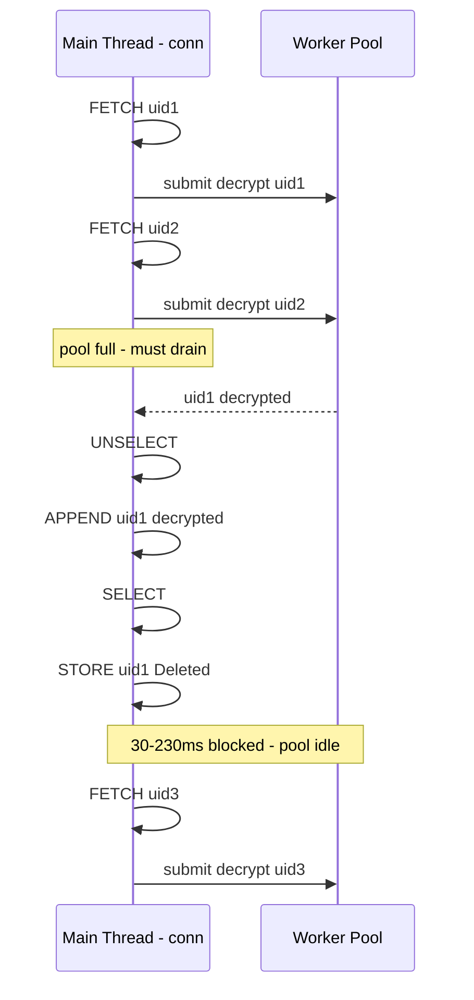
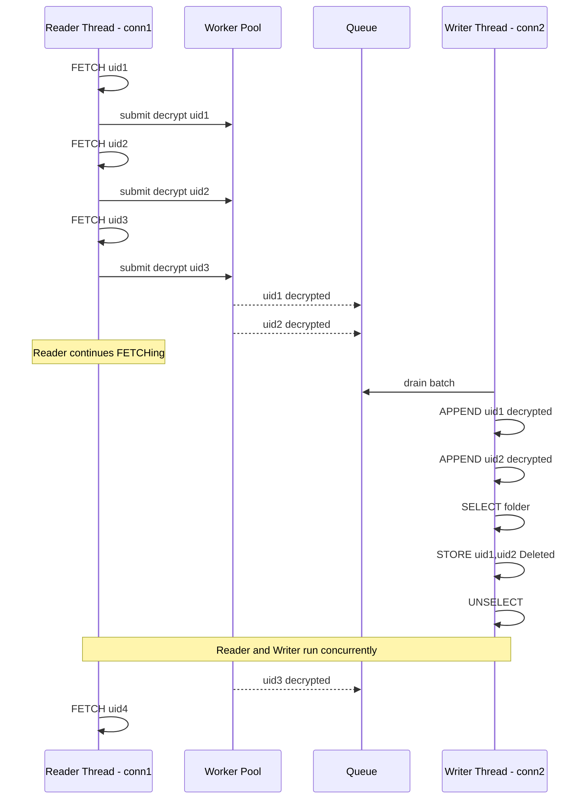

# Parallel Pipeline Improvement Plan

## Problem

When processing a single folder with `--workers N`, the current [`_process_parallel()`](smime/processor.py:576) pipeline has a structural bottleneck: the **main thread** does both FETCH (read) and REPLACE (write) on the **same IMAP connection**, so the two operations serialise against each other.

### Current Pipeline

```
Main thread:  FETCH₁ → submit → FETCH₂ → submit → [pool full] → drain(block) → REPLACE₁ → REPLACE₂ → FETCH₃ → ...
Workers:               decrypt₁          decrypt₂                                                       decrypt₃
```

The [`replace_message()`](smime/processor.py:223) cycle — UNSELECT → APPEND → SELECT → STORE — takes **~30–230ms** per message (depending on VirtioFS latency). While the main thread is replacing, it cannot FETCH, so the worker pool starves between drain cycles.

**Observed**: `--workers 32` achieves ~32 msg/s but cannot go higher. The decrypt workers finish faster than the main thread can feed them.

### Root Cause



## Proposed Solution: Dual-Connection Reader/Writer Pipeline

Split the single IMAP connection into two:

| Thread | Connection | Mode | Responsibility |
|---|---|---|---|
| Reader | conn1 | readonly SELECT | FETCH raw messages → submit to pool |
| Writer | conn2 | initially unselected | APPEND decrypted → batch STORE Deleted |
| Workers | none | thread-safe | openssl decrypt subprocesses |

### New Pipeline



### Key Design Points

1. **Reader thread** continuously FETCHes on a readonly connection and submits to the decrypt worker pool. It never blocks on REPLACE operations. This keeps the pool saturated.

2. **Writer thread** consumes from a `queue.Queue` of completed decryptions. It batches multiple APPENDs before doing a single SELECT → batch STORE → UNSELECT cycle, amortising the SELECT/UNSELECT overhead.

3. **Decoupled connections** — conn1 is readonly, conn2 handles all writes. Since dotlocks are now on fast native ext4 (after the `mail_index_path`/`mail_control_path` fix), the writer APPENDing while the reader has the folder SELECTed should not cause contention.

4. **Memory bounded** — The reader pauses when the pool + write queue exceed a configurable high-water mark (e.g. `2 * workers` messages in flight), preventing OOM for large folders.

5. **Graceful fallback** — If Phase 0 validation shows dual-connection APPEND still has dotlock issues, the implementation can degrade to the current single-connection pipeline by simply not spawning the writer thread.

### Batch STORE Optimisation

The writer can batch-STORE `\Deleted` on multiple UIDs in a single command:

```python
# Current: one STORE per message
conn.add_flags([uid], [b"\\Deleted"])

# Batched: single STORE for all UIDs in the batch
conn.add_flags(uid_list, [b"\\Deleted"])
```

imapclient supports UID lists natively, so `conn.add_flags([uid1, uid2, uid3], ...)` sends one `UID STORE uid1,uid2,uid3 +FLAGS (\Deleted)` command.

### Per-Message Cost Comparison

| Phase | Current | Proposed |
|---|---|---|
| FETCH | ~5–10ms, serialised with REPLACE | ~5–10ms, continuous on reader |
| Decrypt | overlapped via workers | overlapped via workers, no stalls |
| APPEND per msg | ~15–100ms, serialised on main | ~15–100ms, on dedicated writer |
| SELECT/UNSELECT | once per message = 2× ~5ms | once per batch of B messages = 2×5ms/B |
| STORE per msg | ~5ms per message | batched: ~5ms for B messages |
| **Effective overhead** | **30–115ms/msg blocking the reader** | **~0ms blocking the reader** |

### Expected Throughput

The reader can sustain ~100–200 FETCHes/sec for average-sized messages. The decrypt pool at 32 workers can sustain ~32 decryptions/sec (openssl subprocess bound). The writer only needs to keep up with ~32 APPENDs/sec, which is feasible at ~15–100ms/APPEND.

Expected improvement: from ~32 msg/s to closer to the openssl-bound throughput, potentially **40–60+ msg/s** with a single folder, depending on APPEND latency.

## Phases

### Phase 0: Validate Dual-Connection APPEND

Write a standalone test script that:

1. Opens two `imapclient` connections to the Dovecot server
2. Connection 1: SELECT a test folder readonly
3. Connection 2: APPEND 20 small test messages to the same folder in rapid succession
4. Measure per-APPEND latency and check Dovecot logs for dotlock warnings
5. Clean up test messages

**Pass criteria**: Average APPEND latency <100ms, no `dotlock was overridden` warnings in Dovecot logs.

**If validation fails**: Skip to Phase 3 (single-connection improvements only), which still provides incremental gains.

### Phase 1: Writer Thread + Queue

Refactor [`_process_parallel()`](smime/processor.py:576) into a three-stage pipeline:

#### 1.1 Add write queue and writer thread

- Add `_writer_thread()` function that:
  - Consumes `MessageRecord` items from a `queue.Queue`
  - Opens its own IMAP connection (conn2)
  - Batches APPENDs (configurable `batch_size`, default 10)
  - After each batch: SELECT → batch STORE \Deleted → UNSELECT
  - Increments counters and calls callbacks
  - Handles errors per the existing `_handle_message_outcome()` pattern
  - Exits when it receives a sentinel `None` from the queue

#### 1.2 Refactor reader loop

- The reader loop (currently the main thread in `_process_parallel()`) becomes:
  - FETCH → submit to pool → when futures complete, put result on write queue
  - No longer calls `replace_message()` directly
  - Pauses submitting when `pool active + queue.qsize() >= 2 * workers`

#### 1.3 Coordination

- Reader signals writer completion by putting `None` on the queue
- Writer thread joins before returning results
- Interrupt flag checked in all three stages (reader, workers, writer)
- Errors from writer propagated back via a shared error list or threading.Event

### Phase 2: Separate Reader Thread

Move the FETCH+submit loop off the main thread entirely:

#### 2.1 Reader as a dedicated thread

- Reader thread opens conn1 (readonly SELECT), FETCHes messages, submits to pool
- Main thread coordinates: starts reader, starts writer, waits for both
- This allows the main thread to do progress reporting without contending with IMAP I/O

#### 2.2 Backpressure via bounded queue

- Use `queue.Queue(maxsize=2*workers)` between pool output and writer input
- Reader naturally pauses when pool is saturated (existing `len(futures) >= workers` check)
- Writer naturally pauses when queue is empty

### Phase 3: Single-Connection Improvements (Fallback)

These improvements apply regardless of whether dual-connection works. Implement them either way:

#### 3.1 Batch STORE \Deleted

Even with a single connection, the current code does UNSELECT → APPEND → SELECT → STORE for **each** message. Instead:

- Accumulate UIDs of successfully APPENDed messages
- After N APPENDs (or all done), do a single SELECT → batch STORE → UNSELECT
- Requires tracking which UIDs have been APPENDed but not yet STORE'd

This reduces the number of SELECT/UNSELECT cycles from N to N/batch_size.

#### 3.2 Pre-fetch window

Currently the main thread fetches one message, submits for decryption, then checks if the pool is full. Instead:

- Pre-fetch the next message while the pool is decrypting
- Keep a small buffer (2–3 messages) of pre-fetched raw data ready to submit
- When a future completes and gets drained, the next message is already fetched and can be submitted immediately

### Phase 4: Integration with `--connections`

When `--connections > 1`, each folder already gets its own IMAP connection. The dual-connection pipeline within each folder means each folder now uses **2** connections. Update the `--connections` semantics:

- Document that each folder uses 2 connections internally (reader + writer)
- The `--connections N` flag controls how many folders process in parallel, each using 2 connections (so total connections = `2 * N + 1` including the listing connection)
- Alternatively, add `--pipeline` flag to opt-in to dual-connection mode per folder

## File Changes

| File | Change | Phase |
|---|---|---|
| `test-dual-conn.py` | New — validation test script | 0 |
| [`smime/processor.py`](smime/processor.py) | Add `_writer_thread()`, refactor `_process_parallel()`, add batch STORE logic | 1, 2, 3 |
| [`smime/imap.py`](smime/imap.py) | Add `batch_store_deleted()` helper | 3 |
| [`smime/cli.py`](smime/cli.py) | Possibly add `--pipeline` flag | 4 |
| [`decrypt-smime.py`](decrypt-smime.py) | Update connection count documentation/display | 4 |
| [`DECRYPT-SMIME.md`](DECRYPT-SMIME.md) | Document new pipeline architecture and performance results | all |

## Risk Mitigation

| Risk | Mitigation |
|---|---|
| Dotlock contention still exists on dual-connection APPEND | Phase 0 validation; fall back to Phase 3 single-connection improvements |
| Writer thread crash leaves APPENDed messages without STORE Deleted | Track pending-APPEND UIDs; on error, log which UIDs need manual cleanup. Same risk as current interrupted-run scenario. |
| Memory usage with pre-fetched + in-flight messages | Bounded queue + pool size limit caps at ~2*workers messages in memory |
| Complexity increase | Writer thread is self-contained; reader loop is simpler without REPLACE calls; `_handle_message_outcome()` already abstracts the error/move/ignore logic |

## Testing

1. **Phase 0 validation script** — manual run, check logs
2. **`--dryrun --workers 32`** — validates reader+worker pipeline without writer
3. **Full decrypt `--workers 32` on test folder** — compare msg/s with current pipeline
4. **`--connections 3 --workers 16`** — validates dual-connection within multi-folder parallelism
5. **Ctrl-C during processing** — validates interrupt propagation to reader, workers, and writer
6. **`--move-failures`** — validates writer handles move-to-failed correctly
7. **`--ignore-failures`** — validates writer continues after errors
